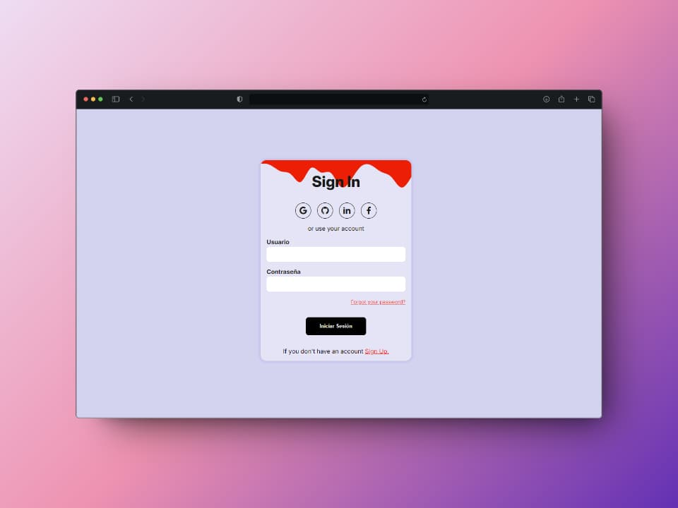
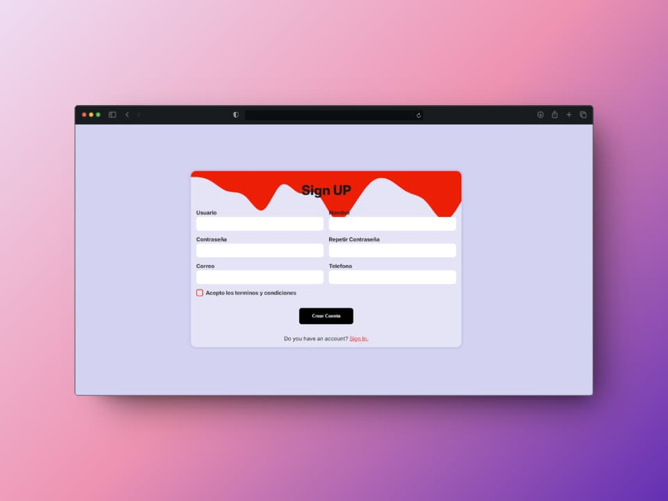
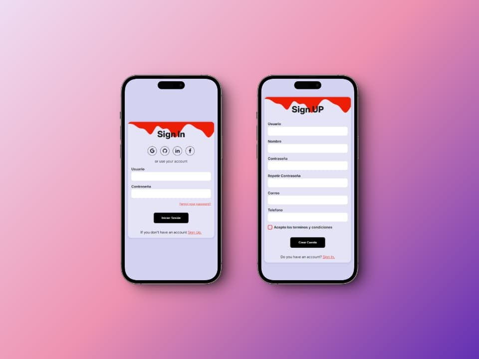

# Login React - Responsive

**Description:** Este proyecto incluye formularios para el registro e inicio de sesión de usuarios.

Vista previa :telescope: [Login-react-netlify.app](https://thunderous-froyo-8e41d4.netlify.app/ "https://thunderous-froyo-8e41d4.netlify.app/") :rocket:

## Capturas

## Licencia
MIT
